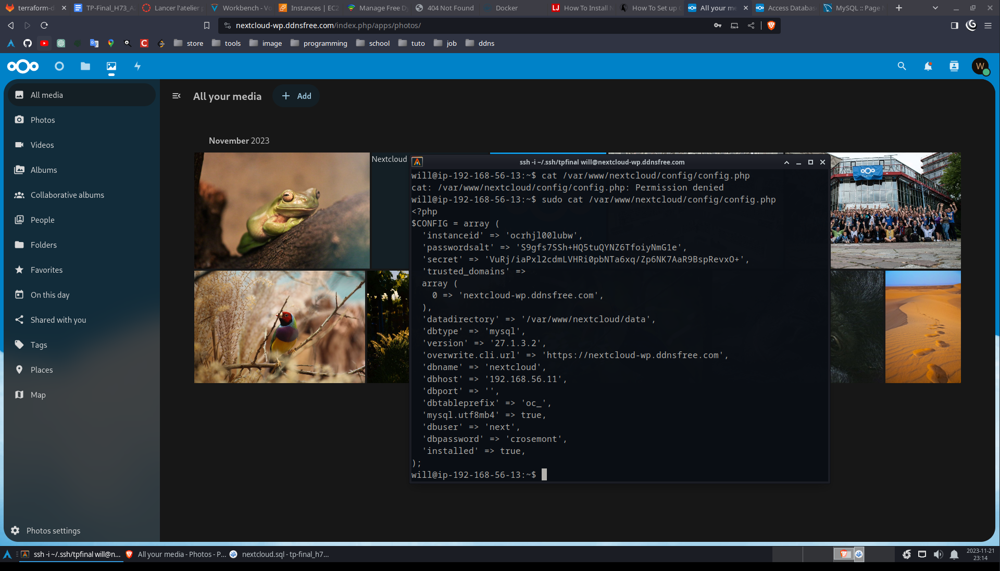

# TP-Final_H73_A23 par William Pelletier

## Table des matieres

1. [Introduction](#introduction)
2. [Question du gestionnaire chez Jey INC.](#question-du-gestionaire-chez-jey-inc)
    1. [Solution d'hébergement dans le cloud](#solution-dhébergement-dans-le-cloud)
    2. [Amiliroation de l'infrastructure](#amilioration-de-linfrastructure)
3. [Environnement](#environement)
    1. [Les machines](#les-machines)
    2. [Réseau](#réseau)
        1. [Règles AWS](#règles-aws)
        2. [Règles UFW](#règles-ufw)
4. [Preuves](#preuves)
    1. [Connexion SSH](#connexion-ssh)
    2. [Page Internet et nom de domaine](#page-internet-et-nom-de-domaine)
    3. [Fonctionnement du serveur VPN](#fonctionnement-du-vpn)
    4. [Fonctionnement du serveur Nextcloud](#fonctionnement-du-nextcloud)
    5. [Fonctionnement du serveur Mattermost](#fonctionnement-du-mattermost)
    6. [Fonctionnement du serveur Sql](#fonctionnement-du-serveur-sql)
    7. [Fonctionnement du serveur Glpi](#fonctionnement-du-serveur-glpi)
5. [Sources](#sources)

## Introduction 

Dans le dossier setup se trouve un projet Terraform. J'ai utilisé ceci, car étant seul à travailler sur le projet et la nécessité de créer un Bucket, l'environnement (Sandbox) de AWS se réinitialise à chaque nouvelle connexion. Ainsi, cela me permettait de remonter rapidement mon environnement entre les différentes fois où je travaillais dessus. La seule chose qui devait changer, c'étaient mes adresses publiques sur dynu.com que je devais mettre à jour.

Dans le dossier record se trouvent toutes les preuves photos et vidéos que ce document utilise.

Notez que pour des raisons de support différentes des visualiseurs de fichiers Markdown, vous ne serez peut-être pas en mesure de visualiser
les preuves vidéos directement dans le fichier Markdown. Par exemple, sur Gitlab dans le navigateur Brave, je n'ai aucun problème, mais dans
Vscodium, je ne les vois pas, alors j'ai mis un lien vers le fichier vidéo à chaque emplacement où une vidéo est censée être.

## Question du gestionnaire chez Jey INC.

Vous trouverez ici les réponses aux deux questions posées dans ce travail pratique.

### Solution d'hébergement dans le cloud

Ma première recommandation serait IBM Cloud, car elle offre une grande variété de produits et services (plus de 170) pour tous les besoins différents. Elle travaille activement avec d'autres fournisseurs tiers pour incorporer leurs produits, ce qui peut être intéressant. Un désavantage est que pour mettre en place une solution à court terme, IBM Cloud peut prendre beaucoup plus de temps que d'autres acteurs de l'industrie[^1]. De plus, il a été rapporté que IBM Cloud n'offre pas beaucoup de support à la clientèle. Ceci peut être un problème pour une entreprise rencontrant des difficultés dans son environnement[^2].

Ma deuxième recommandation serait DigitalOcean, car elle est une plateforme conviviale pour les débutants dans le domaine. Il suffit de prendre comme preuve la grande variété de documentation qu'elle offre à tous dans le monde de l'informatique. De plus, par exemple par rapport au fournisseur GoDaddy et leur 'uptime' de 99,96%, DigitalOcean a un 'uptime' de 100%, montrant ainsi leur dévouement à offrir un produit et un service tout au long de l'année. Comme inconvénient, il n'offre pas de service à la clientèle 24h/7. De plus, contrairement à de nombreux autres fournisseurs du même domaine, il n'offre pas de gratuité, ce qui peut toujours être intéressant pour les plus petites entreprises[^3].


### Amilioration de l'infrastructure

Il serait intéressant de mettre en place un pare-feu de nouvelle génération pour avoir un plus grand contrôle sur les entrées et sorties de nos infrastructures et une plus grande facilité de gestion. Des pare-feu comme Palo-Alto seraient idéaux, car leur intégration dans le cloud et avec notre service VPN serait assez simple.

En prenant en compte la recommandation précédente, il serait intéressant de mettre en place un reverse-proxy dans une DMZ qui pourrait rediriger le trafic entrant par le pare-feu (port forwarding vers le reverse-proxy sur les ports http et https) vers nos différents serveurs selon le sous-domaine spécifié dans la requête http. Cela nous permettrait aussi d'avoir un seul certificat SSL à gérer pour notre domaine. Nous aurions juste à créer une entrée A ou AAAA dans un DNS et ajouter des entrées CNAME pour chaque sous-domaine qui pointerait tous vers l'entrée A ou AAAA de notre domaine. De ce fait, nous aurions juste une adresse publique à gérer pour tous.

## Environement

### Les machines
---
| Nom        | Service         | Fournisseur | Type de machine | Systeme d'exploitation  | Adresse Prive | Adreses Publique | Mot de passe |
| ---------- | --------------- | ----------- | --------------- | ----------------------- | ------------- | ---------------- | ------------ |
| Vpn        | OpenVPN         | AWS         | t2.small        | Ubuntu Server 22.04 LTS | 192.168.56.10 | Dynamique        | crosemont    |
| SqlServer  | Docker(Mariadb) | AWS         | t2.small        | Ubuntu Server 22.04 LTS | 192.168.56.11 | Dynamique        | crosemont    |
| Glpi       | Docker(Glpi)    | AWS         | t2.small        | Ubuntu Server 22.04 LTS | 192.168.56.12 | Dynamique        | crosemont    |
| Nextcloud  | Nextcloud       | AWS         | t2.small        | Ubuntu Server 22.04 LTS | 192.168.56.13 | Dynamique        | crosemont    |
| Mattermost | Mattermost      | AWS         | t2.small        | Ubuntu Server 22.04 LTS | 192.168.56.14 | Dynamique        | crosemont    |


### Réseau
---

Voici les différentes règles de pare-feu qui ont été attribuées à toutes les différentes machines sur AWS et directement dans les machines grâce à UFW.

#### Règles AWS 
----
| Machine    | Description                           | Protocole | type    | ports  | Adresse         |
| ---------- | ------------------------------------- | --------- | ------- | ------ | --------------- |
| Vpn        | laisse passer tous le traffic sortant | TOUS      | egress  | TOUS   | 0.0.0.0/0       |
| SqlServer  | laisse passer tous le traffic sortant | TOUS      | egress  | TOUS   | 0.0.0.0/0       |
| Glpi       | laisse passer tous le traffic sortant | TOUS      | egress  | TOUS   | 0.0.0.0/0       |
| Mattermost | laisse passer tous le traffic sortant | TOUS      | egress  | TOUS   | 0.0.0.0/0       |
| Nextcloud  | laisse passer tous le traffic sortant | TOUS      | egress  | TOUS   | 0.0.0.0/0       |
| Vpn        | connexion ssh entrant                 | TCP       | ingress | 22     | 0.0.0.0/0       |
| SqlServer  | connexion ssh entrant                 | TCP       | ingress | 22     | 0.0.0.0/0       |
| Glpi       | connexion ssh entrant                 | TCP       | ingress | 22     | 0.0.0.0/0       |
| NextCloud  | connexion ssh entrant                 | TCP       | ingress | 22     | 0.0.0.0/0       |
| Mattermost | connexion ssh entrant                 | TCP       | ingress | 22     | 0.0.0.0/0       |
| Vpn        | Icmp localement                       | ICMP      | ingress | TOUS   | 192.168.56.0/24 |
| SqlServer  | Icmp localement                       | ICMP      | ingress | TOUS   | 192.168.56.0/24 |
| Glpi       | Icmp localement                       | ICMP      | ingress | TOUS   | 192.168.56.0/24 |
| Nextcloud  | Icmp localement                       | ICMP      | ingress | TOUS   | 192.168.56.0/24 |
| Mattermost | Icmp localement                       | ICMP      | ingress | TOUS   | 192.168.56.0/24 |
| Vpn        | port utiliser par OpenVPN             | UDP       | ingress | 1194   | 0.0.0.0/0       |
| Glpi       | accès à la page web par l'internet    | TCP       | ingress | 80,443 | 0.0.0.0/0       |
| Mattermost | accès à la page web par l'internet    | TCP       | ingress | 80,443 | 0.0.0.0/0       |
| Nextcloud  | accès à la page web par l'internet    | TCP       | ingress | 80,443 | 0.0.0.0/0       |
| Glpi       | accès à la page web par l'internet    | TCP       | ingress | 80,443 | 0.0.0.0/0       |
| SqlServer  | connexion locale à la base de données | TCP       | ingress | 3306   | 192.168.56.0/24 |

#### Règles UFW
----

Voici la table des règles de UFW de chaque machine.


#### Vpn:
```
To                         Action      From
--                         ------      ----
1194/udp                   ALLOW       Anywhere                  
22                         ALLOW       10.8.0.0/24               
1194/udp (v6)              ALLOW       Anywhere (v6)   
```
#### SqlServer:
```
To                         Action      From
--                         ------      ----
80                         ALLOW       Anywhere       
443                        ALLOW       Anywhere         
22                         ALLOW       192.168.56.0/24    
```
#### Glpi:
```
To                         Action      From
--                         ------      ----
80                         ALLOW       Anywhere       
443                        ALLOW       Anywhere         
22                         ALLOW       192.168.56.0/24  
```
#### Nextcloud:
```
80                         ALLOW       Anywhere       
443                        ALLOW       Anywhere
8806/tcp                   ALLOW       Anywhere        
22                         ALLOW       192.168.56.0/24   
```
#### Mattermost:
```
80                         ALLOW       Anywhere       
443                        ALLOW       Anywhere         
22                         ALLOW       192.168.56.0/24    
```

## Preuves

### Connexion SSH

Étant donné que toutes les connexions SSH à nos serveurs doivent s'initier localement dans le réseau privé, celles venant de l'extérieur
doivent passer par notre service OpenVPN. Vous verrez une démonstration de connexion par une machine virtuelle connectée à notre service
VPN et une tentative de connexion sur ma machine à la maison qui vous démontrera le fonctionnement.

#### VPN
----
Lien vers la [video](./record/ssh/vpn.mp4)


#### ServerSQL
----
Lien vers la [video](./record/ssh/sqlserv.mp4)


#### GLPI
----
Lien vers la [video](./record/ssh/glpi.mp4)


#### NextCloud
----
Lien vers la [video](./record/ssh/nextcloud.mp4)


#### Mattermost
----
Lien vers la [video](./record/ssh/mattermost.mp4)


### Page Internet et nom de domaine

Dans cette section, vous verrez que nos 3 services accessibles par l'internet ont un nom de domaine et un certificat de sécurité reconnu.

Les noms de domaine sont émis par dynu.com:


La preuve pour chaque service:


#### GLPI
----


#### Mattermost
----


#### Nextcloud
----


### Fonctionnement du VPN

Pour vous montrer que le fonctionnement du serveur OpenVPN, je vous montre ma localisation approximative de ma machine, selon mon
adresse IP publique.


### Fonctionnement du Nextcloud

Pour vous montrer le fonctionnement du serveur Nextcloud, je vous montre la page web et le fichier de configuration pour que vous voyiez que
la base de données de Nextcloud se trouve sur notre serveur SQL.



Aussi, je vous montre qu'une connexion à un bucket nommé nextcloud-tpfinal.


### Fonctionnement du Mattermost

Pour déployer le service Mattermost, j'ai utilisé le même [script](./script/mattermost/mattermost-install.sh) que pour le travail pratique précédent. Il utilise un serveur nginx comme proxy pour obtenir un certificat SSL. J'ai comme preuve de son fonctionnement la même photo que je vous montre pour montrer son certificat émis par Let's Encrypt. On peut voir que j'arrive à me connecter à la page d'accueil de Mattermost.


### Fonctionnement du serveur SQL

Le serveur SQL sera exécuté dans un conteneur Docker MariaDB fourni par la fondation MariaDB  ([source](https://hub.docker.com/_/mariadb)).
Toutes les bases de données des autres services se retrouveront dans ce conteneur. Voici la liste :


Voici comment chaque base de données a été créée. J'ai créé un simple [Dockerfile](script/mysql/Dockerfile) pour que des scripts de création de base de données s'exécutent automatiquement au lancement du Docker. Ceux-ci se trouvent dans le dossier script/mysql.


#### Glpi
```
CREATE DATABASE glpi;

CREATE USER 'glpi'@'192.168.56.12' IDENTIFIED BY 'crosemont';

GRANT ALL PRIVILEGES ON glpi.* TO 'glpi'@'192.168.56.12';

FLUSH PRIVILEGES;
```
#### Mattermost
```
CREATE DATABASE mattermost;

CREATE USER 'mmuser'@'192.168.56.14' IDENTIFIED BY 'crosemont';

GRANT ALL PRIVILEGES ON mattermost.* TO 'mmuser'@'192.168.56.14';

FLUSH PRIVILEGES;
```
#### NextCloud
```
CREATE DATABASE nextcloud;

CREATE USER 'next'@'192.168.56.13' IDENTIFIED BY 'crosemont';

GRANT ALL PRIVILEGES ON nextcloud.* TO 'next'@'192.168.56.13';

FLUSH PRIVILEGES;

```

### Fonctionnement du serveur Glpi


Le service GLPI sera exécuté dans un conteneur Docker fourni [ici](https://github.com/DiouxX/docker-glpi). J'ai simplement fait du port forwarding pour exposer les ports 80 et 443 au port du serveur qui l'exécute.

À la différence des autres services, je peux vous montrer clairement que sa base de données se trouve dans mon serveur MariaDB selon l'adresse dans le tableau de la section [Environement](#environement). Voici la preuve :


Lien vers la [video](./record/glpi/glpi-sql.mp4)


Quant à l'inventaire des machines, je vous ai fait une vidéo montrant clairement que je pars d'un inventaire vide. Ensuite, dans ma machine virtuelle connectée au VPN, j'exécute l'agent GLPI en SSH pour chaque machine, y compris ma machine virtuelle elle-même. Notez à la fin quand je montre l'inventaire dans GLPI que les 5 machines ont des valeurs similaires et que ma VM est clairement spécifiée comme étant de type VirtualBox.

Lien vers la [video](./record/glpi/glpi-inventoriat.mp4)


## Sources

[^1]:https://www.softacom.com/blog/pros_and_cons_of_ibm_cloud_platform/
[^2]:https://www.quora.com/What-are-the-advantages-and-disadvantages-of-IBM-cloud
[^3]:https://websitesetup.org/hosting-reviews/digitalocean/